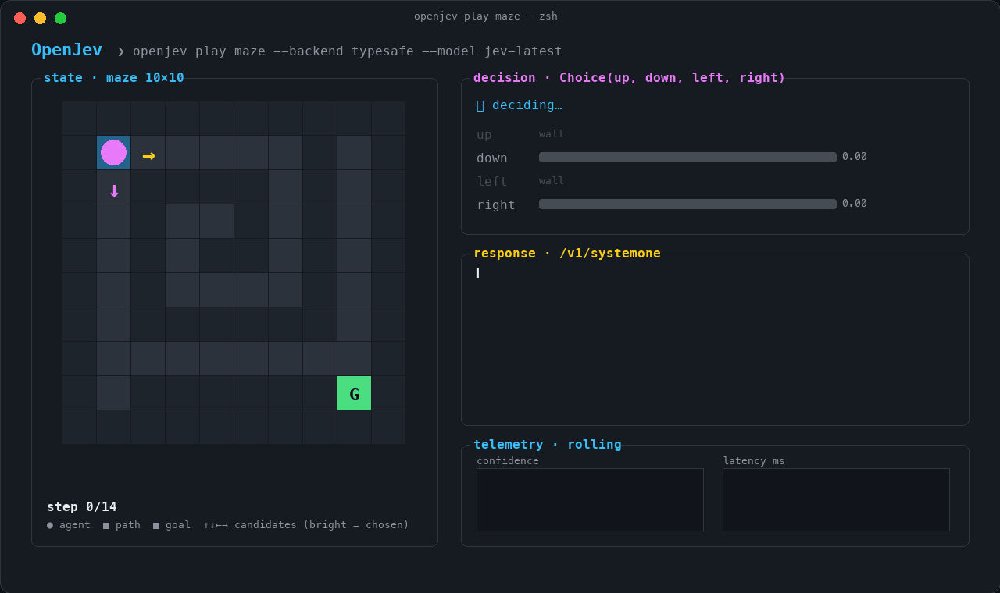
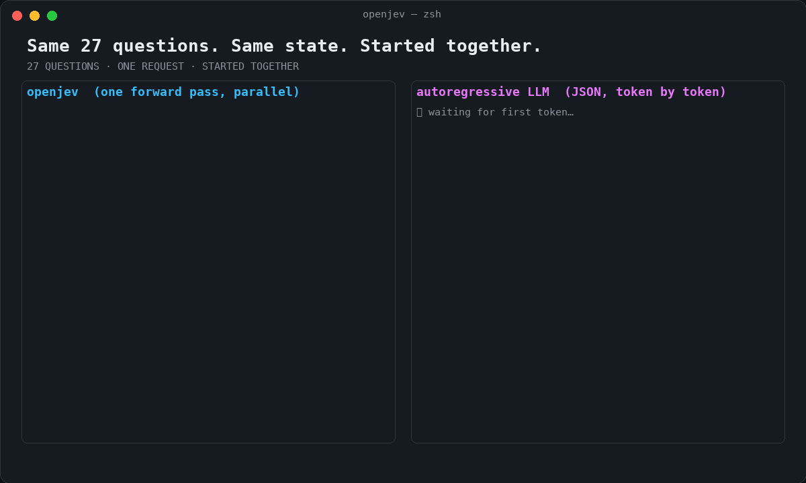
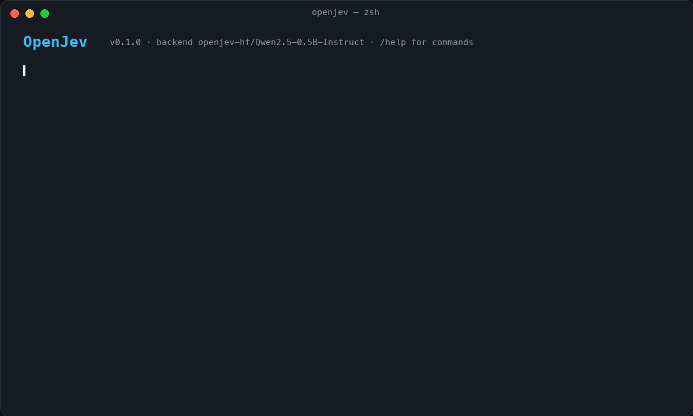
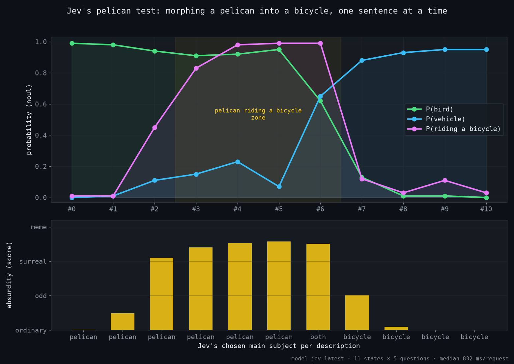
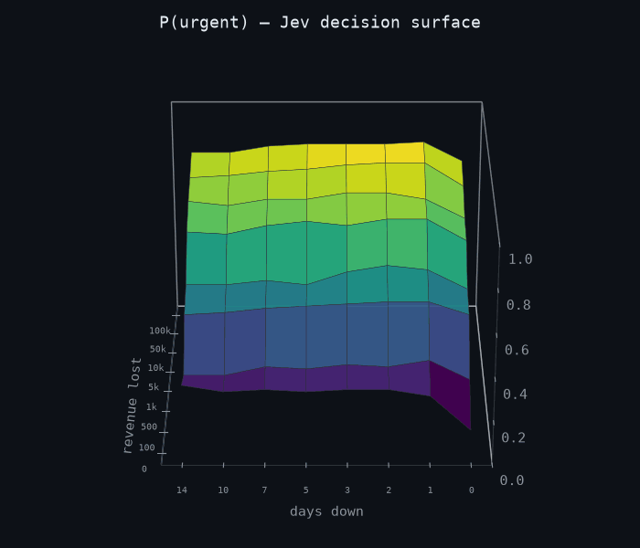
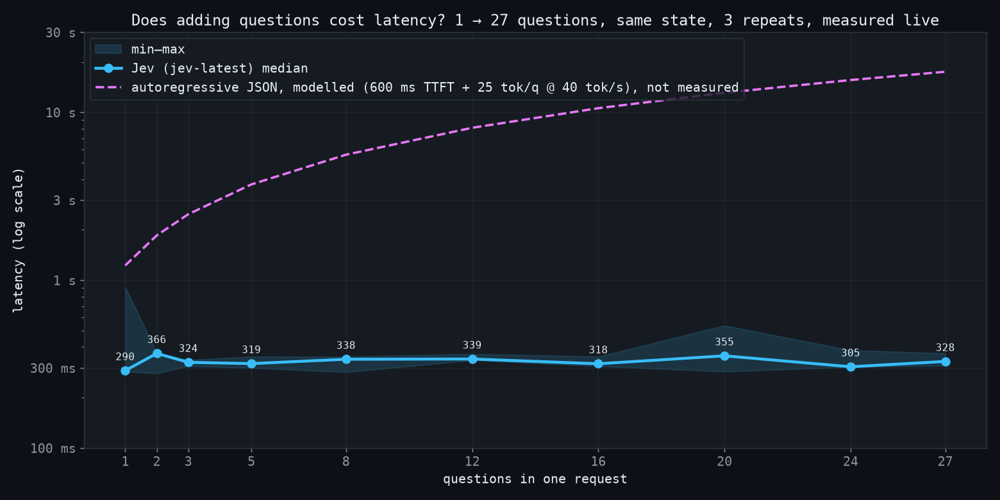
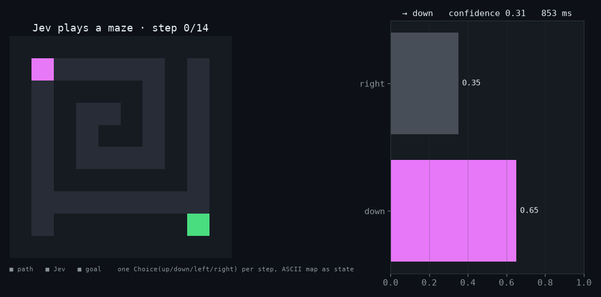
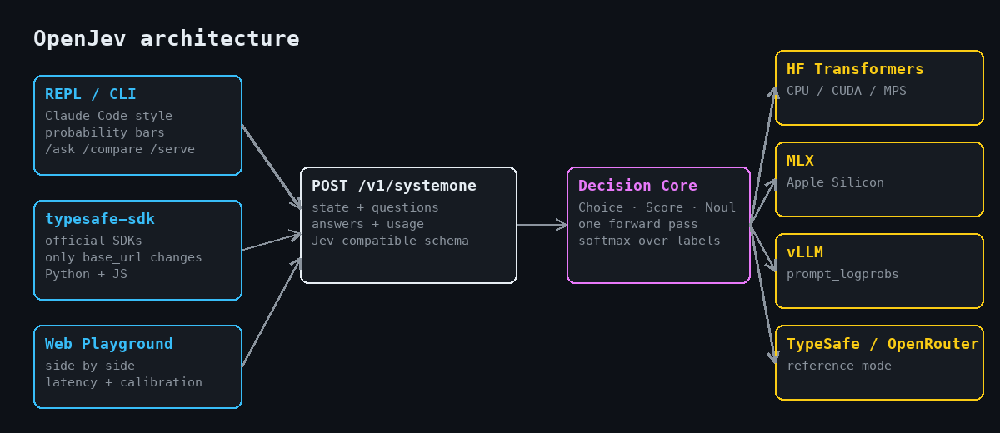
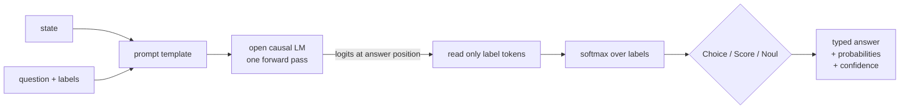

<div align="center">

# OpenJev

**An open-source, Jev-compatible System One decision engine with a Claude Code style REPL.**

Typed decisions (`Choice` · `Score` · `Noul`) from open models in one forward pass. No JSON parsing, no hallucinated shapes, every answer comes with a probability.

[](https://github.com/GPT-AGI/OpenJev/actions/workflows/ci.yml)
[](LICENSE)
[](pyproject.toml)
[](#roadmap)


<br><sub><code>openjev play maze</code> · left: live state · right: streaming <code>/v1/systemone</code> response, option probabilities, rolling confidence & latency. Replays <b>real</b> Jev decisions (14 moves, shortest path, 0 tokens generated).</sub>

</div>

> **Independent project.** OpenJev reproduces the *interface pattern* of TypeSafe's [Jev](https://typesafe.ai/blog/introducing-system-one-models-and-jev) with open-weight models. It does **not** reproduce Jev's undisclosed model or training, and it is not affiliated with or endorsed by TypeSafe. Jev and TypeSafe are trademarks of their respective owners.

---

## Why

Most decisions inside an agent are small: *route this, retry that, is this tool call dangerous, which option wins?* A chat model can answer them, but it spends hundreds of tokens generating text that your code immediately parses back into an `if`.

Jev showed that a **System One model** can answer typed questions in ~100 ms with calibrated probabilities. OpenJev brings that experience to open models, and adds the thing the ecosystem is missing: **a terminal you can actually watch decisions happen in**, the same way [Clawd-Code](https://github.com/GPT-AGI/Clawd-Code) gives you a Claude Code style REPL in Python.

<div align="center">

<br><sub>Same 27 questions, same state, started together. One forward pass per question vs. autoregressive JSON. (Illustrative animation; measured numbers below.)</sub>
</div>

## What you can run today

The concept above is the Phase 1-2 target UI. The REPL that ships now already renders the same probability bars, confidence and latency for every decision:

<div align="center">

</div>

## Live experiments against the real Jev

OpenJev ships a reference harness that runs real experiments against the official API, so every claim in this README can be re-measured with one command. Full write-up in [docs/EXPERIMENTS.md](docs/EXPERIMENTS.md).

<table>
<tr>
<td width="50%">

<br><sub><b>The pelican test.</b> Morph a pelican into a bicycle one sentence at a time. P(bird) and P(vehicle) cross exactly where Jev says the subject is <code>both</code>; absurdity peaks while the pelican is riding.</sub>
</td>
<td width="50%">

<br><sub><b>Decision landscape.</b> 64 tickets on a days-down × revenue-lost grid, one call each. P(urgent) rises monotonically from 0.11 to 0.85; priority flips P3 → P1 with a cliff around day 3-5.</sub>
</td>
</tr>
<tr>
<td>

<br><sub><b>Adding questions is nearly free.</b> Measured live: 290 ms for 1 question, 328 ms for 27 (output tokens 23 → 594). Dashed line is a modelled autoregressive baseline.</sub>
</td>
<td>

<br><sub><b>Jev plays a maze.</b> One <code>Choice</code> per step, ASCII map as state. Shortest path (14 moves) in 5.4 s. Confidence drops to 0.6 exactly at the corners and sits at 0.99 in corridors.</sub>
</td>
</tr>
</table>

```bash
echo 'TYPESAFE_API_KEY=...' > .env
uv pip install -e ".[experiments]"
python scripts/experiments.py all      # pelican · surface · latency · maze, ~130 calls
```

## What you get

- **Three primitives, Jev-compatible schema.** `Choice` (pick one of up to 255 options), `Score` (probability-weighted grade on an ordered legend), `Noul` (P(true) for a yes/no judgement). Same request/response shape as `POST /v1/systemone`.
- **Claude Code style REPL.** Paste a state, add questions with slash commands, hit `/ask`, watch probability bars stream in with confidence and latency.
- **One forward pass.** Logits are read at the answer position and softmaxed over *your* labels only. Nothing outside the option set can win. No decoding loop.
- **Pluggable backends.** Hugging Face Transformers today (CPU / CUDA / MPS). MLX, vLLM and a TypeSafe/OpenRouter reference mode on the roadmap.
- **Drop-in for the official SDKs** (Phase 1). Point `typesafe-sdk` or `@typesafe-ai/sdk` at `http://localhost:8000` and keep your code.

<div align="center"></div>

## Quick start

```bash
git clone https://github.com/GPT-AGI/OpenJev.git && cd OpenJev
uv venv --python 3.11 && source .venv/bin/activate
uv pip install -e ".[dev]"          # core + REPL, runs anywhere with the mock backend
uv pip install -e ".[hf]"           # + real models via Transformers

openjev                              # mock backend, instant, no download
openjev --backend hf --model Qwen/Qwen2.5-0.5B-Instruct
```

Inside the REPL:

```text
❯ /state "Customer: our Stripe integration has been failing for 3 days, payments are down. Fix it today."
❯ /choice dept "Which department should handle this?" billing,technical,sales
❯ /score frustration "How frustrated is the customer?" 0:calm,1:annoyed,2:furious
❯ /noul urgent "Does this need immediate escalation?"
❯ /ask
```

Or use it as a library:

```python
from openjev import Choice, Noul, Score, SystemOneRequest
from openjev.backends import get_backend

backend = get_backend("hf", model_id="Qwen/Qwen2.5-0.5B-Instruct")
resp = backend.decide(SystemOneRequest(
    state={"ticket": "Stripe integration failed for 3 days, payments down"},
    questions={
        "dept": Choice(instructions="Which department?", options=["billing", "technical", "sales"]),
        "urgent": Noul(instructions="Does this need immediate escalation?"),
        "frustration": Score(instructions="Customer frustration?", legend={"0": "calm", "1": "annoyed", "2": "furious"}),
    },
))
print(resp.answers["dept"].choice, resp.answers["dept"].confidence)   # technical 0.84
print(resp.answers["urgent"].noul)                                     # 0.96
print(resp.answers["frustration"].score)                               # 1.23
print(resp.latency_ms)
```

Response shape (identical to the Jev docs):

```json
{
  "model": "openjev-hf/Qwen2.5-0.5B-Instruct",
  "answers": {
    "dept":        {"type": "choice", "choice": "technical", "probabilities": {"technical": 0.91, "billing": 0.07, "sales": 0.02}, "confidence": 0.84},
    "urgent":      {"type": "noul",   "noul": 0.96},
    "frustration": {"type": "score",  "score": 1.23, "legend": {"0": "calm", "1": "annoyed", "2": "furious"}, "probabilities": {"0": 0.08, "1": 0.61, "2": 0.31}, "confidence": 0.42}
  },
  "usage": {"input_tokens": 312, "output_tokens": 8}
}
```

## How it works



`confidence` is `1 - normalized entropy` of the label distribution (TypeSafe does not publish its formula; this is a transparent approximation). Raw probabilities from zero-shot models are over-confident, so Phase 2 adds temperature calibration against your own labelled data.

## Roadmap

| Phase | Goal | Status |
|---|---|---|
| **0** | Core primitives, HF backend, Claude Code style REPL, demo GIFs | ✅ this release |
| **1** | `openjev serve`: FastAPI `POST /v1/systemone`, official SDKs work by changing `base_url`; shared-state prefill with KV-cache reuse; session save/load | 🔜 |
| **2** | Web Playground: side-by-side OpenJev vs Jev vs LLM-JSON with probability bars, latency and cost; `openjev eval` with accuracy + ECE on public sets; temperature calibration | ⏳ |
| **3** | Backends: MLX (Apple Silicon), vLLM (`prompt_logprobs`), TypeSafe / OpenRouter reference mode; agent middlewares (tool-call guardrail, model router, RAG reranker); `SKILL.md` for Claude Code / Clawd-Code | ⏳ |
| **4** | Train a lightweight decision head (NanoJev / jevlike style) with calibration losses; publish weights; Docker + one-click deploy | ⏳ |

Full design notes in [docs/DESIGN.md](docs/DESIGN.md).

## Related work

The Jev launch triggered a wave of open reproductions. OpenJev builds on what they learned and focuses on the developer-facing experience.

- [TheoLeeCJ/SemIf](https://github.com/TheoLeeCJ/SemIf) (formerly OpenJev) — single-token logits, WebGPU browser demo
- [daseinlabs/open-jev](https://github.com/daseinlabs/open-jev) — multi-token option scoring with KV-cache reuse, MLX, Doom demo
- [ikermoel/open-alternative-jev](https://github.com/ikermoel/open-alternative-jev) — HF + vLLM, packed vs separate modes, honest benchmarks
- [TianyuCodings/NanoJev](https://github.com/TianyuCodings/NanoJev) — actually trains a decision head on Qwen3-0.6B
- [vinnylarouge/jevlike](https://github.com/vinnylarouge/jevlike) — option-attention scorer trained from scratch
- [vLLM PR #57250](https://github.com/vllm-project/vllm/pull/57250) — DiffusionGemma as a Jev-like via one denoising step

## Contributing

PRs welcome. `uv pip install -e ".[dev]" && pytest && ruff check src tests`. See [CONTRIBUTING.md](CONTRIBUTING.md).

## License

MIT. See [LICENSE](LICENSE).
