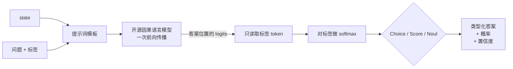

<div align="center">

# OpenJev

**开源、兼容 Jev 接口的 System One 决策引擎，自带 Claude Code 风格的终端 REPL。**

用开源模型一次前向传播输出类型化决策（`Choice` · `Score` · `Noul`）。不解析 JSON，不会生成不合规的输出形状，每个答案都附带概率。

[English](README.md) · **简体中文**

[](https://github.com/GPT-AGI/OpenJev/actions/workflows/ci.yml)
[](LICENSE)
[](pyproject.toml)
[](#路线图)


<br><sub><code>openjev play maze</code> · 左侧：实时状态 · 右侧：流式 <code>/v1/systemone</code> 响应、各选项概率、滚动置信度与延迟。回放的是<b>真实</b> Jev 决策（14 步，最短路径，0 个生成 token）。</sub>

</div>

> **独立项目。** OpenJev 用开源权重模型复现 TypeSafe [Jev](https://typesafe.ai/blog/introducing-system-one-models-and-jev) 的*接口模式*，**不**复现 Jev 未公开的模型与训练方法，与 TypeSafe 无任何关联、未获其背书。Jev 与 TypeSafe 为各自所有者的商标。

---

## 为什么做这个

Agent 内部的大多数决策都很小：*该路由到哪、要不要重试、这个工具调用危险吗、哪个选项更好？* 聊天模型能回答，但它要花几百个 token 生成一段文字，然后你的代码马上把它解析回一个 `if`。

Jev 证明了 **System One 模型**可以在约 100 ms 内用校准过的概率回答类型化问题。OpenJev 把这种体验带到开源模型上，并补上生态里缺的那一块：**一个能亲眼看到决策发生过程的终端**，就像 [Clawd-Code](https://github.com/GPT-AGI/Clawd-Code) 用 Python 给你一个 Claude Code 风格的 REPL 一样。

<div align="center">

<br><sub>同样 27 个问题、同一个 state、同时开跑。每个问题一次前向传播 vs. 自回归逐 token 生成 JSON。（示意动画；实测数据见下文。）</sub>
</div>

## 现在就能跑的

上面是 Phase 1-2 的目标 UI 概念。当前发布的 REPL 已经对每个决策渲染同样的概率条、置信度和延迟：

<div align="center">

</div>

## 对真实 Jev 的在线实验

OpenJev 自带一套参照实验脚本，直接打官方 API，README 里的每个结论都能用一条命令重新测量。完整报告见 [docs/EXPERIMENTS.md](docs/EXPERIMENTS.md)。

<table>
<tr>
<td width="50%">

<br><sub><b>鹈鹕测试。</b>把鹈鹕一句一句地变成自行车。P(鸟) 与 P(交通工具) 恰好在 Jev 判定主体为 <code>both</code> 的那句交叉；荒诞度在鹈鹕骑车时达到峰值。</sub>
</td>
<td width="50%">

<br><sub><b>决策地形。</b>宕机天数 × 损失金额网格上的 64 张工单，每张一次调用。P(紧急) 从 0.11 单调升到 0.85；优先级在第 3-5 天附近出现从 P3 到 P1 的悬崖。</sub>
</td>
</tr>
<tr>
<td>

<br><sub><b>加问题几乎不加延迟。</b>实测：1 个问题 290 ms，27 个问题 328 ms（输出 token 23 → 594）。虚线为建模的自回归基线。</sub>
</td>
<td>

<br><sub><b>Jev 走迷宫。</b>每步一个 <code>Choice</code>，ASCII 地图作为 state。14 步最短路径，共 5.4 s。置信度在拐角处恰好掉到 0.6，走廊里稳定在 0.99。</sub>
</td>
</tr>
</table>

```bash
echo 'TYPESAFE_API_KEY=...' > .env
uv pip install -e ".[experiments]"
python scripts/experiments.py all      # pelican · surface · latency · maze，约 130 次调用
```

## 你会得到什么

- **三种原语，Jev 兼容 schema。** `Choice`（最多 255 个选项中选一）、`Score`（在有序等级上按概率加权打分）、`Noul`（是/否判断的 P(true)）。请求/响应形状与 `POST /v1/systemone` 完全一致。
- **Claude Code 风格 REPL。** 粘贴 state，用斜杠命令添加问题，敲 `/ask`，看概率条连同置信度和延迟流式出现。
- **一次前向传播。** 在答案位置读取 logits，只对*你的*标签做 softmax。选项集之外的东西不可能胜出，没有解码循环。
- **可插拔后端。** 现在支持 Hugging Face Transformers（CPU / CUDA / MPS）。MLX、vLLM 以及 TypeSafe/OpenRouter 参照模式在路线图上。
- **官方 SDK 直接替换**（Phase 1）。把 `typesafe-sdk` 或 `@typesafe-ai/sdk` 指向 `http://localhost:8000`，业务代码一行不改。

<div align="center"></div>

## 快速开始

```bash
git clone https://github.com/GPT-AGI/OpenJev.git && cd OpenJev
uv venv --python 3.11 && source .venv/bin/activate
uv pip install -e ".[dev]"          # 核心 + REPL，mock 后端在任何机器都能跑
uv pip install -e ".[hf]"           # + 通过 Transformers 加载真实模型

openjev                              # mock 后端，即开即用，无需下载
openjev --backend hf --model Qwen/Qwen2.5-0.5B-Instruct
```

在 REPL 中：

```text
❯ /state "客户：我们的 Stripe 集成已经连续失败 3 天，支付完全中断。今天必须修好。"
❯ /choice dept "应该由哪个部门处理？" billing,technical,sales
❯ /score frustration "客户有多愤怒？" 0:平静,1:不满,2:愤怒
❯ /noul urgent "需要立即升级处理吗？"
❯ /ask
```

或作为库使用：

```python
from openjev import Choice, Noul, Score, SystemOneRequest
from openjev.backends import get_backend

backend = get_backend("hf", model_id="Qwen/Qwen2.5-0.5B-Instruct")
resp = backend.decide(SystemOneRequest(
    state={"ticket": "Stripe 集成失败 3 天，支付中断"},
    questions={
        "dept": Choice(instructions="哪个部门负责？", options=["billing", "technical", "sales"]),
        "urgent": Noul(instructions="需要立即升级处理吗？"),
        "frustration": Score(instructions="客户愤怒程度？", legend={"0": "平静", "1": "不满", "2": "愤怒"}),
    },
))
print(resp.answers["dept"].choice, resp.answers["dept"].confidence)   # technical 0.84
print(resp.answers["urgent"].noul)                                     # 0.96
print(resp.answers["frustration"].score)                               # 1.23
print(resp.latency_ms)
```

响应形状（与 Jev 官方文档一致）：

```json
{
  "model": "openjev-hf/Qwen2.5-0.5B-Instruct",
  "answers": {
    "dept":        {"type": "choice", "choice": "technical", "probabilities": {"technical": 0.91, "billing": 0.07, "sales": 0.02}, "confidence": 0.84},
    "urgent":      {"type": "noul",   "noul": 0.96},
    "frustration": {"type": "score",  "score": 1.23, "legend": {"0": "平静", "1": "不满", "2": "愤怒"}, "probabilities": {"0": 0.08, "1": 0.61, "2": 0.31}, "confidence": 0.42}
  },
  "usage": {"input_tokens": 312, "output_tokens": 8}
}
```

## 工作原理



`confidence` 取标签分布的 `1 - 归一化熵`（TypeSafe 未公开其公式，这是一个透明的近似）。零样本模型的原始概率偏向过度自信，Phase 2 会加入基于你自己标注数据的温度校准。

## 路线图

| 阶段 | 目标 | 状态 |
|---|---|---|
| **0** | 核心原语、HF 后端、Claude Code 风格 REPL、演示动图 | ✅ 本次发布 |
| **1** | `openjev serve`：FastAPI `POST /v1/systemone`，官方 SDK 只改 `base_url` 即可使用；共享 state 的 KV-cache 复用；会话保存/加载 | 🔜 |
| **2** | Web Playground：OpenJev vs Jev vs LLM-JSON 并排对比（概率条、延迟、成本）；`openjev eval` 在公开数据集上输出准确率 + ECE；温度校准 | ⏳ |
| **3** | 后端：MLX（Apple Silicon）、vLLM（`prompt_logprobs`）、TypeSafe / OpenRouter 参照模式；Agent 中间件（工具调用安全闸、模型路由、RAG 重排）；供 Claude Code / Clawd-Code 使用的 `SKILL.md` | ⏳ |
| **4** | 训练轻量决策头（NanoJev / jevlike 思路）并加入校准损失；发布权重；Docker + 一键部署 | ⏳ |

完整设计说明见 [docs/DESIGN.md](docs/DESIGN.md)。

## 相关工作

Jev 发布后引发了一波开源复现。OpenJev 吸收了它们的经验，并把重心放在面向开发者的体验上。

- [TheoLeeCJ/SemIf](https://github.com/TheoLeeCJ/SemIf)（原名 OpenJev）— 单 token logits，WebGPU 浏览器演示
- [daseinlabs/open-jev](https://github.com/daseinlabs/open-jev) — 多 token 选项打分 + KV-cache 复用，MLX，Doom 演示
- [ikermoel/open-alternative-jev](https://github.com/ikermoel/open-alternative-jev) — HF + vLLM，packed / separate 两种模式，诚实的基准测试
- [TianyuCodings/NanoJev](https://github.com/TianyuCodings/NanoJev) — 真正在 Qwen3-0.6B 上训练决策头
- [vinnylarouge/jevlike](https://github.com/vinnylarouge/jevlike) — 从零训练的 option-attention 打分器
- [vLLM PR #57250](https://github.com/vllm-project/vllm/pull/57250) — 用 DiffusionGemma 单步去噪实现 Jev 式决策

## 参与贡献

欢迎 PR。`uv pip install -e ".[dev]" && pytest && ruff check src tests`。详见 [CONTRIBUTING.md](CONTRIBUTING.md)。

## 许可证

MIT，见 [LICENSE](LICENSE)。
