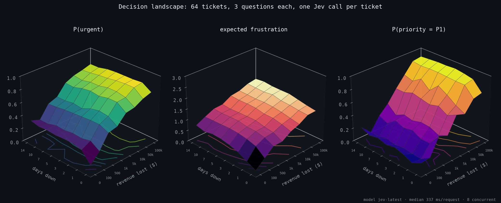

# Live experiments against the real Jev API

All figures below were produced by [`scripts/experiments.py`](../scripts/experiments.py) against
`jev-latest` (served by `jev-1.13.0`) on 2026-09-20 from a laptop in Shenzhen. Raw JSON for each
run is written to `results/` (git-ignored). Re-run with your own key:

```bash
echo 'TYPESAFE_API_KEY=...' > .env
.venv/bin/python scripts/experiments.py all          # ~130 API calls, well under $0.01
.venv/bin/python scripts/experiments.py maze --replot # redraw from results/ without calling the API
```

These experiments are the reference OpenJev is measured against: Phase 2 runs the same script with
`--backend openjev` and overlays both curves.

---

## 1. The pelican test

Eleven descriptions morph a pelican into a bicycle one sentence at a time. Each is sent with five
questions: `Noul` bird / vehicle / riding, a `Choice` for the main subject, and a `Score` for absurdity.


What the data says:

- `P(bird)` and `P(vehicle)` cross exactly at description #6, "a bicycle being ridden by a pelican",
  which is also the only description Jev labels `both`.
- `P(riding a bicycle)` is ~0 until the pelican touches a pedal (#3, 0.83), stays near 1.0 while it
  rides, and collapses to 0.12 the moment the pelican becomes a bell.
- Absurdity peaks at 2.57 / 3 ("clearly surreal" leaning "meme material") for the fast-riding
  pelican, and is 0.00 for a plain pelican on a pier and 0.00 for a parked bicycle.
- Median 832 ms per request with 6 concurrent calls (cold cache; sequential calls sit around 300 ms).

## 2. Decision landscape (3D)

A 8 × 8 grid of support tickets: days down ∈ {0…14} × revenue lost ∈ {$0…$100k}. One call per ticket
with three questions.




- `P(urgent)` climbs from 0.11 (0 days, $0) to 0.85 (14 days, $100k) and the surface is monotone in
  both axes, which is what you want from a routing signal.
- Expected frustration follows the same shape but is flatter: Jev separates "how bad is it" from
  "how angry are they".
- Priority flips from `P3` at the origin to `P1` in the far corner; the `P(P1)` surface has a sharp
  cliff around 3-5 days regardless of revenue, i.e. Jev treats duration as the stronger cue.
- 64 requests, 8 concurrent, median 337 ms.

## 3. Does adding questions cost latency?

Same ticket, 1 → 27 questions in one request, 3 repeats each, sequential.


- Median latency: **290 ms for 1 question, 328 ms for 27 questions.** Output tokens grow 23 → 594,
  latency grows 13%.
- The dashed line is a *modelled* autoregressive baseline (600 ms TTFT + 25 output tokens per
  question at 40 tok/s), not a measurement. Phase 2 replaces it with a measured LLM-JSON run.

## 4. Jev plays a maze

A 10 × 10 ASCII gridworld. At each step Jev gets the map (with visited cells marked), its position,
the goal and the legal moves, and answers one `Choice` over {up, down, left, right}.


- Reached the goal in **14 moves, which is the shortest path.** 5.4 s wall-clock for the whole run.
- Confidence tells the story: 0.31 at the start (two open directions, no information), 0.84-0.92 in
  the first corridor, 0.99-1.00 along the long bottom corridor, dipping to 0.68 and 0.62 at the two
  corners where a turn is required, then 0.99 for the final step onto `G`.
- No text was generated at any point. The controller is `pos = legal[answer.choice]`.

---

## Notes on honesty

- Sample sizes are small (11 / 64 / 30 / 14 calls). These are demonstrations of *behaviour*, not
  benchmarks. Accuracy and calibration benchmarks on public datasets land in Phase 2.
- Jev outputs are not fully deterministic: repeated identical calls move `choice` probabilities by
  a few points.
- The latency baseline in §3 is modelled. It is drawn dashed and labelled as such.
